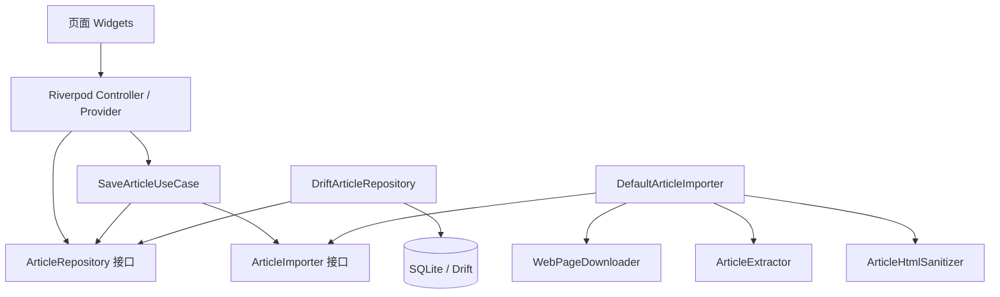

# 纯本地 Android 稍后读应用：MVP 开发方案

> 规划日期：2026-08-27
> 当前项目：`read_it_later`（Flutter 新建模板，尚无业务代码）
> 本机版本：Flutter 3.47.1 stable、Dart 3.13.1、Android compile/target SDK 36、默认 min SDK 24

## 1. 最终结论

第一版采用下面这套技术组合：

| 领域 | 选择 | 原因 |
|---|---|---|
| UI | Flutter Material 3 + `DynamicSchemeVariant.expressive` | 当前 SDK 原生可用，能获得接近 MD3E 的配色和视觉语言 |
| 状态管理/依赖注入 | Riverpod（不使用 Riverpod 代码生成） | 页面状态和依赖关系清楚，测试时容易替换实现 |
| 路由 | `go_router` | 两个页面也能保持清晰，并为深链、分享入口留出扩展空间 |
| 本地数据库 | Drift + SQLite | 类型安全、响应式查询、事务和迁移支持完整，适合长期维护 |
| 网络 | `http` | MVP 足够简单，后续仍可在接口后替换为 Dio |
| 正文抽取 | `reader_mode`，封装在 `ArticleExtractor` 接口后 | 纯 Dart、接入简单，是 Mozilla Readability.js 的移植实现 |
| HTML 处理 | `html` | 用 DOM API 清洗和修正 HTML，不用字符串硬切 |
| 正文渲染 | `flutter_widget_from_html_core` | 不依赖 WebView，支持常见文章标签、表格和可配置渲染模式 |
| 外部链接 | `url_launcher` | 对通过白名单验证的链接交给系统浏览器打开 |
| 测试 | `flutter_test` + `mocktail` + Drift 内存数据库 | 覆盖核心流程而不依赖真实网站 |

总体架构采用“按功能分组、内部按层拆分”的方式：

```text
UI 页面/Controller
        ↓
保存文章用例（业务流程）
        ↓
领域接口（Repository / Importer）
        ↑
数据库、网络、Readability、HTML 清洗的具体实现
```

关键设计决定是：**任何页面都不直接调用 Readability、HTTP 或 SQLite**。第三方包全部藏在接口后面。以后更换解析器、加入 WebView 兜底、下载图片或增加同步时，不需要重写 UI。

## 2. MVP 边界与验收标准

### 2.1 第一版必须完成

1. Android 应用可安装、可启动，不依赖账号、服务器或云数据库。
2. 主页面使用 Material 3 Expressive 风格，展示所有已保存文章。
3. 主页面有“添加文章”按钮。
4. 用户输入一个 HTTPS 链接后，应用下载网页 HTML、抽取正文、清洗内容并存入本地 SQLite。
5. 保存成功后文章立即出现在列表中，重启应用后仍存在。
6. 点击列表项进入阅读页，在应用内渲染标题、来源、作者和正文。
7. 保存完成后，在无网络情况下仍能打开正文文字和已保存的 HTML 格式。
8. 非法 URL、超时、非 HTML、正文抽取失败、重复文章等情况均给出可理解的提示，应用不崩溃。

### 2.2 第一版明确不做

- 登录、服务器、云同步、统计和崩溃上报。
- 浏览器“分享到本应用”。第一版只手动输入或粘贴 URL。
- 标签、搜索、归档、已读状态、阅读进度、Markdown/JSON 导出。
- JavaScript 动态渲染网页、登录墙、付费墙、验证码和浏览器 Cookie。
- 图片本地化下载。第一版的正文文字可离线，但图片仍引用远程 URL，无网时图片可能不可见。
- 音频、视频、iframe、网页脚本和原站 CSS。

这里的“纯本地”准确含义是：**无账号、无自建服务器、无云同步，抽取结果只存设备私有目录**。添加网页时仍然必须联网。若要求图片也完全离线，需要在后续增加资源下载表和本地文件缓存。

## 3. 资料调研后的关键判断

### 3.1 Flutter 与 MD3E

当前 Flutter 3.47.1 已支持：

```dart
ColorScheme.fromSeed(
  seedColor: seedColor,
  brightness: brightness,
  dynamicSchemeVariant: DynamicSchemeVariant.expressive,
)
```

但 Flutter 官方 issue `#168813` 仍将“完整引入 Material 3 Expressive”列为后续工作；当前 SDK 源码也明确说明 MD3E spring 尚未完整支持。因此本项目应表述为“**MD3E 风格**”，实现方式是：

- 使用 `ThemeData(useMaterial3: true)`。
- 使用 `DynamicSchemeVariant.expressive` 生成亮/暗色方案。
- 使用大标题、清晰层级、强调 FAB、形状变化和较有表现力的过渡。
- 优先使用 Flutter 官方 Material 组件，不复制尚未稳定的私有 MD3E API。
- 将颜色、形状、间距和动画集中放在 `app_theme.dart`，将来官方组件到位后只改主题和少数组件。

### 3.2 Readability 的选择

Mozilla 官方 `@mozilla/readability` 是 Firefox Reader View 使用的 JavaScript 库。它要求一个 DOM `document`，Flutter/Dart 不能直接调用。可选路线如下：

| 路线 | 优点 | 缺点 | 决定 |
|---|---|---|---|
| `reader_mode` 纯 Dart 移植 | 无 WebView/原生桥，API 简单，可放到 isolate | 新项目、使用量较低，需要实际网页验证 | MVP 首选 |
| 官方 Readability.js + 隐藏 WebView/JS runtime | 与 Mozilla 官方算法最接近 | DOM/JS 桥、资源打包、生命周期和安全处理更复杂 | 解析质量不足时的第二实现 |
| `readability` Flutter 插件 | Android/iOS 可用 | 实际包装的是 Go Shiori，不是 Mozilla；依赖原生二进制 | 不选 |
| 直接显示网页 WebView | 原网页兼容性高 | 不是干净阅读模式，也很难做到可靠离线和统一样式 | 不选 |

`reader_mode` 当前版本为 0.2.2，并不等同于 Mozilla 官方发行包。必须用 `ArticleExtractor` 接口隔离，并在开发前期用代表性网页做一次“解析器闸门测试”：至少测试 10 个目标网站，8 个以上能正确抽取标题和主体才继续采用；否则尽早实现官方 Readability.js 适配器，而不是等 UI 完成后再返工。

### 3.3 正文渲染方式

第一版使用 `flutter_widget_from_html_core`，而不使用 WebView：

- HTML 会变成 Flutter Widget，阅读页字体、颜色和暗色模式可由应用统一控制。
- core 版不带 iframe、视频和音频依赖，攻击面和安装包体积更小。
- 脚本不会执行，但仍必须先清洗 HTML，因为它可加载网络图片、文件 URL 或触发链接。
- 特别长的正文使用其 `RenderMode.listView`/分块能力，避免一次构建过大的 Widget 树；具体接入时需避免在另一个同方向滚动视图内嵌 ListView。

### 3.4 数据库选择

选择 Drift，而不是直接使用 `sqflite`：

- 查询和表结构有静态类型检查，初学者更不容易写出字段名/类型错误。
- `watch()` 查询能自动驱动文章列表更新。
- 原生支持事务、索引、迁移和内存数据库测试。
- SQLite 适合将来增加标签、多对多关系、全文搜索 FTS5 和导出。

Drift 的代价是需要 `build_runner` 生成 `.g.dart` 文件。这个复杂度是可控的，且项目未来收益明显高于手写 SQL。

## 4. 应用架构

### 4.1 分层职责

| 层 | 只负责什么 | 禁止做什么 |
|---|---|---|
| Presentation | Widget、页面状态、用户事件、导航 | 不直接请求网络、不写 SQL、不调用 Readability |
| Application | 编排“检查重复 → 下载 → 抽取 → 清洗 → 保存” | 不依赖 Flutter Widget，不了解数据库表细节 |
| Domain | `Article`、`ArticleDraft`、接口和业务错误 | 不引用 Drift、HTTP、Riverpod 或渲染包 |
| Data | HTTP、字符解码、正文抽取、HTML 清洗、Drift Repository | 不显示 SnackBar、不导航 |
| App/Core | 主题、路由、依赖装配、通用 Result/日志 | 不放某个页面的具体业务 |

依赖方向：



### 4.2 建议目录

```text
lib/
  main.dart
  app/
    app.dart
    app_router.dart
    app_theme.dart
    providers.dart
  core/
    errors/
      app_failure.dart
    result/
      result.dart
    utils/
      url_normalizer.dart
      reading_time.dart
  features/
    articles/
      domain/
        article.dart
        article_draft.dart
        article_list_item.dart
        article_repository.dart
        article_importer.dart
      application/
        save_article_use_case.dart
      data/
        database/
          app_database.dart
          article_dao.dart
        import/
          default_article_importer.dart
          web_page_downloader.dart
          article_extractor.dart
          reader_mode_extractor.dart
          article_html_sanitizer.dart
        repositories/
          drift_article_repository.dart
      presentation/
        controllers/
          save_article_controller.dart
        pages/
          library_page.dart
          reader_page.dart
        widgets/
          add_article_sheet.dart
          article_list_tile.dart
          library_empty_state.dart

test/
  core/
  features/articles/
    application/
    data/
    presentation/

test/fixtures/
  simple_article.html
  chinese_article.html
  malicious_article.html
  non_article.html
```

这是一个业务功能，不要把每个小类拆成独立“feature”。列表、添加和阅读共享同一个 Article 领域，统一放在 `features/articles` 内更容易理解。

## 5. 数据结构与数据库

### 5.1 三种领域对象

不要让 Drift 自动生成的数据类直接流入 UI。定义三个轻量领域对象：

1. `ArticleDraft`：网页成功抽取、尚未入库的完整结果。
2. `Article`：带数据库 `id` 的完整文章，只在阅读页读取。
3. `ArticleListItem`：不含 `contentHtml/contentText` 的列表投影，主页面只加载它。

列表查询若每次把所有正文也读入内存，文章多后会浪费大量内存。单独使用 `ArticleListItem` 是这个项目最值得保留的优化之一。

### 5.2 V1 `articles` 表

| 字段 | SQLite/Drift 类型 | 是否为空 | 含义 |
|---|---|---:|---|
| `id` | INTEGER PK AUTOINCREMENT | 否 | 本地主键 |
| `source_url` | TEXT UNIQUE | 否 | 规范化后的用户输入 URL，用于第一层去重 |
| `resolved_url` | TEXT | 否 | HTTP 跳转后的最终 URL，相对链接以它为基准 |
| `canonical_url` | TEXT | 是 | 页面 `<link rel="canonical">`，抽取不到可为空 |
| `title` | TEXT | 否 | 正文标题 |
| `excerpt` | TEXT | 是 | 摘要，用于列表副文本 |
| `author` | TEXT | 是 | 作者/byline |
| `site_name` | TEXT | 是 | 来源站点 |
| `language` | TEXT | 是 | 页面语言，如 `zh-CN` |
| `published_at` | DATETIME | 是 | 原文发布时间，解析失败为空 |
| `content_html` | TEXT | 否 | **清洗后的**正文 HTML |
| `content_text` | TEXT | 否 | 纯文本，供摘要、搜索和导出使用 |
| `estimated_reading_minutes` | INTEGER | 否 | 估算阅读分钟数，最小为 1 |
| `extractor_version` | TEXT | 否 | 如 `reader_mode/0.2.2`，方便以后重新抽取 |
| `saved_at` | DATETIME | 否 | 保存时间，UTC |
| `updated_at` | DATETIME | 否 | 最后修改时间，UTC |

索引：

- `UNIQUE(source_url)`：阻止同一规范化 URL 重复保存。
- `INDEX(saved_at DESC)`：主列表按最新保存排序。
- 暂不对 `canonical_url` 加唯一约束，多个页面可能声明错误或共用 canonical。

所有时间在数据库中存 UTC，显示时转本地时区。数据库文件由 `drift_flutter` 放在应用私有目录，不申请外部存储权限。

### 5.3 Repository 契约

```dart
abstract interface class ArticleRepository {
  Stream<List<ArticleListItem>> watchAll();
  Future<Article?> getById(int id);
  Future<Article?> findBySourceUrl(Uri url);
  Future<int> insert(ArticleDraft draft);
  Future<void> deleteById(int id);
}

abstract interface class ArticleImporter {
  Future<Result<ArticleDraft>> import(Uri url);
}
```

`deleteById` 第一版可以不放 UI，但 Repository 实现和测试成本很低，也方便开发时清理错误数据。其余未来行为通过 Drift migration 添加，不提前污染 V1：

- V2：`is_read`、`is_archived`、`read_progress`、`last_opened_at`。
- V3：`tags`、`article_tags`。
- V4：`article_assets`，记录远程 URL、本地路径、MIME、大小、哈希和下载状态。
- V5：SQLite FTS5 虚表，对标题、摘要、作者和 `content_text` 建全文索引。

每次 schema 变化必须提高 `schemaVersion`、写迁移和迁移测试，禁止通过卸载应用“解决”数据库错误。

## 6. 添加文章的完整流程

```text
输入/粘贴 URL
  → trim，缺协议时补 https://
  → 只接受 HTTPS，删除 fragment，规范化 host
  → 查询数据库是否重复
  → HTTP GET（超时、重定向、大小限制、HTML 类型检查）
  → 根据响应头/HTML meta 解码字节
  → 在 isolate 中运行 Readability
  → 验证标题与正文长度
  → DOM 白名单清洗、修正链接
  → 计算阅读时间、组装 ArticleDraft
  → SQLite 事务插入
  → 列表 Stream 自动刷新
  → 跳转阅读页
```

### 6.1 URL 规范化

`UrlNormalizer` 的固定规则：

- 去首尾空格。
- 没有 scheme 时补 `https://`。
- 只接受 `https`；第一版不为 HTTP 明文流量放宽 Android 安全配置。
- host 转小写，移除 `#fragment`，保留 query（它可能决定正文内容）。
- 拒绝空 host、用户名/密码式 URL 和无法解析的输入。
- 不盲目删除 `utm_*` 等参数；先保证不误改语义，去追踪参数放到后续版本。

### 6.2 下载器约束

`WebPageDownloader` 使用 `http.Client.send()` 流式接收，而不是无上限地读取 `response.body`：

- 连接/总超时：15 秒。
- 最多重定向：5 次，并在每次重定向后重新验证 HTTPS scheme。
- 最大响应正文：5 MiB，超过立即终止。
- 只接受 2xx。
- `Content-Type` 只接受 `text/html` 或 `application/xhtml+xml`；服务端漏写类型时可在大小限制内尝试解析，但记录为兼容路径。
- 设置正常的移动端 User-Agent 和 `Accept: text/html,application/xhtml+xml`。
- 保存最终响应 URL，供相对图片和链接解析。
- 在 `dispose` 时关闭 Client。

字符编码不要直接假设 `response.body` 永远正确。MVP 可先实现 UTF-8 + `allowMalformed`，同时从 `Content-Type charset` 和前几 KB 的 `<meta charset>` 读取编码；若代表性中文网站包含 GBK/GB18030，再引入 `charset_converter`。编码逻辑单独放在 `HtmlDecoder`，不要混进下载器或抽取器。

### 6.3 抽取器接口

```dart
abstract interface class ArticleExtractor {
  Future<ExtractedArticle> extract({
    required String html,
    required Uri baseUri,
  });
}
```

`ReaderModeExtractor` 做以下事情：

- 调用 `reader_mode.parse(html, baseUri: baseUri.toString(), parser: ParserType.jsdom)`。
- 在顶层函数中通过 `Isolate.run`/`compute` 执行，避免大网页阻塞 UI。
- isolate 返回普通 Map/record，再在主 isolate 转成领域对象，避免跨 isolate 传第三方类型。
- `null`、标题为空或正文过短统一转成 `ArticleNotReadableFailure`。
- 将 `publishedTime` 用 `DateTime.tryParse` 解析，失败时保留为空。

### 6.4 HTML 安全清洗

Mozilla 官方明确说明 Readability **不是 sanitizer**。即使不用 WebView，也必须清洗不可信网页。`ArticleHtmlSanitizer` 使用 `package:html` 的 DOM API：

- 允许结构标签：`p`、`br`、`h1`–`h6`、`strong`、`em`、`blockquote`、`pre`、`code`、`ul`、`ol`、`li`、`figure`、`figcaption`、`img`、`a`、`hr`、`table`、`thead`、`tbody`、`tr`、`th`、`td` 等。
- 删除 `script`、`style`、`iframe`、`object`、`embed`、`form`、`input`、`button`、`link`、`meta`、音视频等。
- 删除所有 `on*` 事件属性、`srcset`、原站 class、id 和 inline style，让阅读页掌控样式。
- `href/src` 使用最终响应 URL 解析成绝对 URL，只保留 `https`。
- 拒绝 `javascript:`、`data:`、`file:`、`content:`、`intent:` 等 scheme。
- 图片缺少合法 `src` 时删除图片；链接非法时保留文字、移除链接能力。
- 数据库只保存清洗后的 HTML，不保存整页原始 HTML。

阅读页的 `onTapUrl` 再做一次 scheme 检查，然后用系统浏览器打开，形成纵深防护。

### 6.5 错误模型

使用一个简单的 sealed `Result<T>`，不要把第三方异常文本直接显示给用户：

```text
InvalidUrlFailure           → “请输入有效的 HTTPS 链接”
DuplicateArticleFailure     → “这篇文章已经保存”
NetworkUnavailableFailure   → “网络不可用，请稍后重试”
NetworkTimeoutFailure       → “网页响应超时”
HttpStatusFailure           → “网页返回了错误状态（状态码）”
UnsupportedContentFailure   → “这个链接不是可读取的网页”
ContentTooLargeFailure      → “网页过大，暂时无法保存”
ArticleNotReadableFailure   → “没有识别出适合阅读的正文”
StorageFailure              → “保存失败，请重试”
UnexpectedFailure           → “处理网页时出现未知问题”
```

调试模式可将原异常和 stack trace 写到 `debugPrint`，Release 不显示敏感技术细节，也不上传日志。

## 7. UI 与交互设计

### 7.1 全局主题

- 同一 seed 分别生成 light/dark `ColorScheme`，使用 `DynamicSchemeVariant.expressive`。
- `MaterialApp.router(themeMode: ThemeMode.system)` 跟随系统亮暗模式。
- 主题集中配置 `AppBarTheme`、`FloatingActionButtonThemeData`、`InputDecorationTheme`、按钮、列表和页面切换。
- 页面背景使用 surface；强调色只用于 FAB、焦点、进度和可点击链接，不把整个页面染成单一色。
- 正文最大宽度约 720dp，手机 20–24dp 横向留白；平板居中，避免一行过长。
- 支持系统字体缩放，任何标题和按钮不能依赖固定高度容纳文字。

### 7.2 主页面 `LibraryPage`

结构：

```text
SliverAppBar.large：稍后读
正文：
  loading → 居中进度
  empty   → 简洁空状态 + “添加第一篇”
  error   → 错误说明 + 重试
  data    → 按 savedAt 倒序的 ListView/SliverList
FAB.extended：添加文章
```

每个 `ArticleListTile` 显示：标题（最多 2 行）、站点/作者、保存日期、预计阅读时长、摘要（最多 2 行）。使用列表和分隔线，不为每篇文章套多层卡片。点击整行打开 `/article/:id`。

### 7.3 添加文章 `AddArticleSheet`

- 由 FAB 打开 `showModalBottomSheet`，开启 `isScrollControlled` 和 drag handle。
- 单个 URL 输入框，键盘类型为 URL，关闭自动纠错和大写。
- 输入框尾部用剪贴板图标执行粘贴；主按钮使用“保存文章”。
- 提交时禁用输入和重复提交，显示“正在获取网页 / 正在整理正文 / 正在保存”中的当前阶段。
- 错误显示在表单内，保留原 URL 便于修改和重试。
- 成功后关闭 sheet，使用新文章 id 跳转阅读页。
- sheet 关闭或页面销毁后，不再操作失效的 `BuildContext`。

### 7.4 阅读页 `ReaderPage`

- AppBar：返回、标题简写、用系统浏览器打开原文。
- 头部：完整标题、站点、作者、发布日期/阅读时间；缺失字段不留空占位。
- 正文：`HtmlWidget`，应用自己的正文大小、行高、标题间距、引用和代码样式。
- 图片使用合法 HTTPS URL；加载失败显示稳定占位，不让布局跳动或崩溃。
- 表格允许横向滚动；超长代码块允许横向滚动。
- 加载不到 id 时显示“文章不存在”，而不是无限进度。

路由仅需：

```text
/                LibraryPage
/article/:id     ReaderPage
```

添加 sheet 不是独立路由。未来浏览器分享和通知深链仍可直接进入 `/article/:id`。

## 8. Riverpod 依赖与状态

第一版不使用 Riverpod annotation/codegen，减少一套生成器。建议 provider 图：

```text
appDatabaseProvider
  → articleDaoProvider
  → articleRepositoryProvider

httpClientProvider
  → webPageDownloaderProvider
readerModeExtractorProvider
articleHtmlSanitizerProvider
  → articleImporterProvider

articleRepositoryProvider + articleImporterProvider
  → saveArticleUseCaseProvider
  → saveArticleControllerProvider

articleRepositoryProvider
  → articleListProvider (StreamProvider)
  → articleByIdProvider (FutureProvider.family)
```

- `articleListProvider` 直接观察 Repository 的 `watchAll()`，数据库变化后 UI 自动更新。
- `SaveArticleController` 只管理一次导入任务及阶段，不包含下载/解析实现。
- Provider 在 `app/providers.dart` 装配具体实现，测试时 override 为 fake。
- `AppDatabase` 和 `http.Client` provider 在销毁时分别调用 `close()`。

## 9. Android 与隐私配置

在 `android/app/src/main/AndroidManifest.xml`：

```xml
<uses-permission android:name="android.permission.INTERNET" />
```

并在 `<application>` 明确设置：

```xml
android:allowBackup="false"
android:usesCleartextTraffic="false"
```

原因：

- `INTERNET` 是普通权限，不会弹运行时授权框。
- 禁止明文 HTTP，所有导入只走 HTTPS。
- Android 默认可能通过 Auto Backup 将应用私有数据备份到用户云端；严格“纯本地”应关闭备份。代价是卸载应用后文章无法恢复，后续应通过用户主动导出解决。
- 不申请读写外部存储、相册、联系人、定位等权限。
- 不加入 Firebase、广告 SDK、遥测 SDK 或后台服务。

当前 Android applicationId 暂定为 `com.heraklysia.read_it_later`。如果未来发布到应用商店，应在首次发布前确认它属于自己的长期标识；一旦发布，不应再修改。

## 10. 依赖清单

调研时可用版本如下。实际添加依赖时用 `flutter pub add` 让 Pub 解出与当前 SDK 兼容的版本，并提交 `pubspec.lock`：

```yaml
dependencies:
  flutter:
    sdk: flutter
  flutter_localizations:
    sdk: flutter
  flutter_riverpod: ^3.4.2
  go_router: ^18.0.0
  drift: ^2.34.3
  drift_flutter: ^0.3.1
  http: ^1.6.0
  reader_mode: ^0.2.2
  html: ^0.15.6
  flutter_widget_from_html_core: ^0.17.2
  url_launcher: ^6.3.2
  intl: ^0.20.3

dev_dependencies:
  flutter_test:
    sdk: flutter
  flutter_lints: ^6.0.0
  build_runner: ^2.16.0
  drift_dev: ^2.34.5
  mocktail: ^1.0.5
```

暂不添加 Dio、Freezed、Riverpod Generator、WebView、图片缓存、SharedPreferences。它们在 V1 没有解决必要问题，只会增加学习面和构建时间。

## 11. Step by step 实施顺序

每一步完成后先运行分析和相关测试，再做一个 Git commit。不要一次写完整个应用后才启动。

### Step 0：修好 Android 开发环境

第 0 步已在 2026-08-27 完成实际构建验收：Flutter/Dart 可用，Android
cmdline-tools、Platform 36、Build Tools、NDK 28.2.13676358 和 Android
模拟器均可用，模板 APK 已成功构建、安装并启动。由于当前 Android
Command-line Tools 23 已弃用旧的 `sdkmanager --licenses` 入口，Flutter
Doctor 可能仍显示 `Android license status unknown`；构建期间 Platform 36
的 license 已被工具接受。

1. 将 `D:\Flutter\flutter\bin` 加到 Windows 用户 PATH，重启终端和 IDE。
2. Android Studio → SDK Manager → SDK Tools，安装最新版 **Android SDK Command-line Tools**。
3. 保留 Android SDK Platform 36 和对应 Build-Tools。
4. 执行 `flutter doctor --android-licenses` 并接受协议。
5. Device Manager 创建一个 API 35/36 的 Pixel 模拟器，或启用真机 USB 调试。
6. 执行 `flutter doctor -v`、`flutter devices`。

完成标准：Android toolchain 为绿色，至少出现一个 Android 设备，模板应用能 `flutter run`。

### Step 1：建立可回退基线

1. 在当前目录初始化 Git（当前目录还不是 Git 仓库）。
2. 运行原始 `flutter test` 和 `flutter analyze`。
3. 删除计数器示例，先保留最小 `MaterialApp`。
4. 确定应用显示名和永久 applicationId。
5. 提交 `chore: initialize flutter project`。

完成标准：干净仓库、模板测试通过、能启动空应用。

### Step 2：添加依赖与应用外壳

1. 按第 10 节添加依赖。
2. 创建 `app.dart`、`app_theme.dart`、`app_router.dart`、`providers.dart`。
3. `main.dart` 只做 `runApp(const ProviderScope(child: App()))`。
4. 实现亮暗 `expressive` ColorScheme 和两个空路由页面。
5. 修改 Manifest：网络权限、关闭备份、关闭明文流量。

完成标准：亮暗主题可跟随系统切换，`/` 和测试 reader 路由均可打开。

### Step 3：先验证正文抽取器（高风险闸门）

1. 创建 `ArticleExtractor`、`ExtractedArticle`、`ReaderModeExtractor`。
2. 添加固定 HTML fixtures，验证标题、作者、正文和相对链接。
3. 写一个仅 Debug 使用的临时测试入口，对 10 个代表性 HTTPS 网页运行下载和抽取。
4. 记录：成功、标题是否正确、正文是否夹杂导航、图片链接是否正确。
5. 成功率低于 80% 时，暂停后续 UI，改做官方 Readability.js adapter spike。

完成标准：fixture 单测通过，目标网站中至少 8/10 结果可读，解析大页面不冻结 UI。

### Step 4：完成领域层和错误模型

1. 创建 `ArticleDraft`、`Article`、`ArticleListItem`。
2. 创建 `Result<T>` 和第 6.5 节的 failure 类型。
3. 定义 `ArticleRepository`、`ArticleImporter` 接口。
4. 实现并测试 `UrlNormalizer`、阅读时间估算。

完成标准：domain/core 不 import Flutter UI、Drift、HTTP 或 Readability 包。

### Step 5：建立 Drift 数据库

1. 在 `app_database.dart` 定义 V1 `ArticleRows` 表和 `AppDatabase`。
2. 在 `article_dao.dart` 写列表投影、按 id 查询、按 URL 查询、插入和删除。
3. 使用 `driftDatabase(name: 'read_it_later')` 打开后台数据库。
4. 执行：

   ```powershell
   dart run build_runner build --delete-conflicting-outputs
   ```

5. 实现 Drift row ↔ domain model 的显式 mapper。
6. 用内存数据库测试排序、唯一 URL、插入后 stream 更新和删除。

完成标准：数据库测试通过；主列表查询生成的 SQL 不选择 `content_html/content_text`。

### Step 6：完成导入流水线

1. 实现 `WebPageDownloader` 的超时、重定向、类型和 5 MiB 上限。
2. 实现 HTML 解码器。
3. 实现 `ArticleHtmlSanitizer` 和恶意 fixture 测试。
4. 实现 `DefaultArticleImporter`：下载 → 抽取 → 清洗 → draft。
5. 实现 `DriftArticleRepository`。
6. 实现 `SaveArticleUseCase`：规范化 → 去重 → import → insert。
7. 用 fake importer/repository 测试成功、重复和各种 failure 映射。

完成标准：不启动 UI 也能通过测试完成“给 URL，返回数据库 id”的完整流程。

### Step 7：实现主页面

1. 创建 `articleListProvider` 监听 Repository stream。
2. 实现 loading、empty、error、data 四种状态。
3. 实现 `ArticleListTile`，只依赖 `ArticleListItem`。
4. 添加 extended FAB 和列表进入 reader 的导航。
5. 替换/删除原模板 widget test。

完成标准：空数据库显示空状态；测试插入文章后列表无需手动刷新即可出现。

### Step 8：实现添加文章 sheet

1. 创建 `SaveArticleController` 和明确的导入阶段状态。
2. 实现 URL 表单、粘贴图标、提交、禁用、进度、错误和重试。
3. 防止连续点击产生并发导入。
4. 成功后关闭 sheet 并导航到新文章。
5. 对输入错误、网络错误和成功路径写 widget test。

完成标准：真实 HTTPS 文章可从 UI 保存，重复保存不产生第二条记录。

### Step 9：实现阅读页

1. 创建 `articleByIdProvider(id)`。
2. 完成阅读页头部、正文排版和外部打开按钮。
3. 使用清洗后的 HTML；链接点击仍二次验证 HTTPS。
4. 处理不存在 id、图片失败、长代码和宽表格。
5. 断网重启应用，验证正文文字仍能打开。

完成标准：至少中英文各 3 篇文章可读，亮暗模式和大字体下无溢出。

### Step 10：整合、性能与隐私检查

1. 在真机/模拟器上测试 1–5 MiB HTML 和长文章。
2. 用 DevTools 检查导入期间 UI 是否掉帧；确认抽取发生在 isolate。
3. 检查数据库没有原始整页 HTML、Cookie、Authorization header 或日志隐私数据。
4. 检查 Manifest 只含 INTERNET 权限且备份关闭。
5. 检查 app 进程重启、系统深色、大字体、横屏和无网状态。

完成标准：核心流程无崩溃、无明显长时间主线程卡顿、无不必要权限。

### Step 11：完成测试矩阵

必须自动化：

- Unit：URL 规范化、阅读时长、Result/failure、抽取 fixtures、HTML 白名单。
- Database：CRUD、唯一约束、列表投影和排序、watch stream。
- Application：保存成功、重复、下载失败、抽取失败、数据库失败。
- Widget：主页面四状态、添加表单状态、阅读页不存在状态。

必须手测：

- 中文新闻、英文博客、Wikipedia、含表格文章、重定向 URL。
- 非文章首页、404、超时、超大页面、无网、重复 URL。
- JavaScript-only 页面应得到可理解的失败，而不是空白文章。
- 保存后开启飞行模式并重启，正文可读；图片不可用属于 V1 已知限制。

不要在 CI/unit test 中依赖真实网站，它们随时会改变。真实网页只用于手动兼容矩阵，自动测试只用本地 fixtures/fakes。

### Step 12：构建验收包

依次执行：

```powershell
dart format --output=none --set-exit-if-changed lib test
flutter analyze
flutter test
flutter build apk --debug
```

在一台真实 Android 设备安装 debug APK，完整执行第 2.1 节。准备发布时再配置自己的签名，并用 `flutter build appbundle --release` 生成 Play Store AAB。

## 12. V1 Definition of Done

- [ ] `flutter doctor` 的 Android 开发链路正常。
- [ ] `flutter analyze` 零 error/warning，`flutter test` 全部通过。
- [ ] 应用安装、首次启动和重启均正常。
- [ ] 主页面符合 Material 3 Expressive 风格且亮暗模式可用。
- [ ] 可输入 HTTPS URL，展示明确的处理进度。
- [ ] 正文抽取、清洗和保存完成，列表自动更新。
- [ ] 点击列表可在应用内渲染正文。
- [ ] 无网时已保存正文文字可读。
- [ ] 重复、非法链接、超时、非文章均不会崩溃。
- [ ] 数据只在应用私有 SQLite；Android Auto Backup 已关闭。
- [ ] 没有 WebView、脚本执行、明文 HTTP、不必要权限和遥测 SDK。
- [ ] README 写明安装运行方法、架构图、已知限制和第三方许可证。

## 13. 后续扩展顺序

按价值和架构影响排序：

1. 浏览器分享入口：Android `ACTION_SEND text/plain`，复用同一个 `SaveArticleUseCase`。
2. 已读/归档/阅读进度：数据库 V2 migration，不改导入器。
3. 本地图片：增加 `article_assets` 和下载队列，将清洗 HTML 的图片 URL 改为本地 URI。
4. 搜索：Drift/SQLite FTS5，以 `content_text` 建索引。
5. 标签：`tags` + `article_tags` 多对多关系。
6. 导出/备份：用户主动导出 JSON/Markdown/ZIP，不恢复系统自动云备份。
7. 解析兜底：官方 Readability.js adapter 或受限 WebView，对 JS-heavy 页面二次抽取。
8. 设置：字体、字号、行高、主题和默认排序；再引入 SharedPreferences。
9. 重新抽取：依据 `extractor_version` 批量升级旧文章，同时保留失败回滚策略。

每一项都通过现有 Repository/Importer 接口接入，不让 UI 知道网页是如何下载或数据库如何存储。

## 14. 主要风险与应对

| 风险 | 影响 | 现在的应对 |
|---|---|---|
| `reader_mode` 较新且用户量低 | 某些网站抽取质量不稳 | Step 3 提前做 10 站闸门测试，并通过接口允许替换 |
| JS 动态网页拿不到正文 | 抽取失败 | V1 明确提示；后续增加官方 JS/WebView 兜底 |
| 字符集不是 UTF-8 | 中文乱码 | 独立 `HtmlDecoder`，按 header/meta 识别，必要时加 converter |
| HTML 含恶意 URL/元素 | 加载本地资源或危险跳转 | DOM 白名单、只留 HTTPS、渲染点击二次校验 |
| 长文章导致卡顿 | 页面掉帧 | 抽取放 isolate；列表不读正文；正文使用合适 render mode |
| SQLite schema 变化 | 用户升级后崩溃/丢数据 | 每版 migration + migration test，绝不依赖卸载重装 |
| “纯本地”却被 Android 自动备份 | 数据可能进入系统云备份 | Manifest 明确 `allowBackup=false` |
| 图片未本地化 | 无网时图片缺失 | 在 V1 文档明确；V3 以 assets 表补齐 |

## 15. 参考资料

以下资料在 2026-08-27 核对可访问：

- [Flutter app architecture guide](https://docs.flutter.dev/app-architecture/guide)
- [Flutter architecture case study](https://docs.flutter.dev/app-architecture/case-study)
- [Flutter Result pattern](https://docs.flutter.dev/app-architecture/design-patterns/result)
- [Flutter Material Design](https://docs.flutter.dev/ui/design/material)
- [Flutter Material 3 migration](https://docs.flutter.dev/release/breaking-changes/material-3-migration)
- [Flutter DynamicSchemeVariant API](https://api.flutter.dev/flutter/material/DynamicSchemeVariant.html)
- [Flutter issue #168813: Bring Material 3 Expressive to Flutter](https://github.com/flutter/flutter/issues/168813)
- [Mozilla Readability](https://github.com/mozilla/readability)
- [`reader_mode` on pub.dev](https://pub.dev/packages/reader_mode)
- [Drift documentation](https://drift.simonbinder.eu/)
- [Riverpod getting started](https://riverpod.dev/docs/introduction/getting_started)
- [`go_router` on pub.dev](https://pub.dev/packages/go_router)
- [`flutter_widget_from_html_core` on pub.dev](https://pub.dev/packages/flutter_widget_from_html_core)
- [Flutter networking](https://docs.flutter.dev/data-and-backend/networking)
- [Flutter testing overview](https://docs.flutter.dev/testing/overview)
- [Android cleartext communication risks](https://developer.android.com/privacy-and-security/risks/cleartext-communications)
- [Android Auto Backup](https://developer.android.com/identity/data/autobackup)
