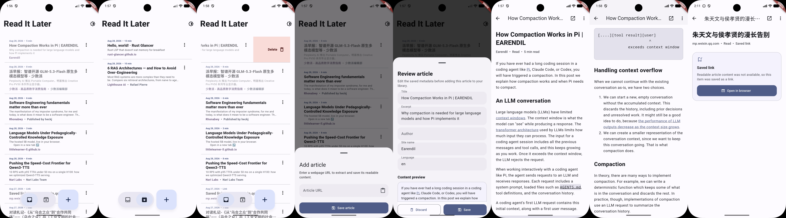
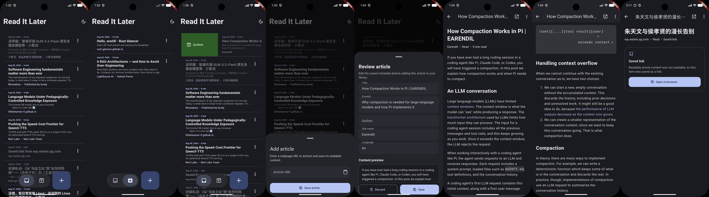

# Readex

Readex 是一个使用 Flutter 构建的本地优先稍后读应用。它会将网页解析为清晰易读的文章并保存在设备本地，因此无需账号或后端服务，也可以随时阅读已保存的内容。

Readex is a local-first read-it-later app built with Flutter. It turns web pages into clean, readable articles stored on the device, so saved content is available without an account or a backend service.

## 预览 / Preview

下面的总览图使用项目中提供的浅色和深色模式拼图，分别对应 `overview_light.jpg` 和 `overview_dark.jpg`。

The overviews below use the supplied light and dark mode collages: `overview_light.jpg` and `overview_dark.jpg`.





## 功能特点 / Features

- 在应用内输入网页链接，导入文章。

  Import article URLs from the in-app add flow.

- 接收其他 Android 应用通过系统分享面板分享过来的链接，并自动进入导入和预览流程。

  Receive links shared from other Android apps through the system share sheet and send them through the import and preview flow.

- 使用 reader-mode 解析流程提取正文，并在必要时使用 HTML 解析回退方案处理页面。

  Download and extract readable article content with a reader-mode pipeline and an HTML fallback when necessary.

- 在 Readex 应用内渲染已保存文章，不需要先打开浏览器。

  Render saved content inside Readex instead of opening the browser first.

- 当页面被拦截、需要验证或无法解析时，保存仅包含标题和链接的 link-only 条目，用户可以按需在浏览器中打开。

  When a page is blocked, protected, or cannot be parsed, save a link-only entry containing its title and URL so the user can open it in a browser when needed.

- 使用 Drift/SQLite 将文章保存在设备本地，不需要账号、服务器或同步服务。

  Store articles locally with Drift/SQLite. No account, server, or sync service is required.

- 提供活动库和已存档文章两个列表视图。

  Browse active library and archived article views.

- 向右滑动条目进行存档，向左滑动条目进行删除，并通过动画完成条目移除和列表重排。

  Swipe right to archive and swipe left to delete, with animated item removal and list reordering.

- 存档和删除后通过浮动 Snackbar 提供 Undo 撤销操作。

  Undo archive and delete actions from a floating Snackbar.

- 支持将文章标记为已读或未读，已读条目使用明显降低的文字强调显示。

  Mark articles as read or unread. Read entries use a visibly muted text treatment.

- 可以编辑已保存条目的元数据，包括标题、作者、来源和摘要；正文内容保持不变。

  Edit saved metadata, including the title, author, source, and summary, while keeping the stored article body unchanged.

- 当文章图片无法加载或解码失败时显示图片占位内容。

  Display an image placeholder when an article image is unavailable or cannot be decoded.

- 在支持的 Android 版本上使用系统 Dynamic Color；系统动态颜色不可用时使用红色种子颜色作为回退方案。

  Use system Dynamic Color on supported Android versions, with a red seed-color fallback when system colors are unavailable.

- 支持系统、浅色和深色三种主题模式。

  Support system, light, and dark theme modes.

- 使用 Material 3 界面，包含浮动的库/存档导航栏、浮动添加按钮、紧凑条目布局和响应式页面结构。

  Use a Material 3 interface with a floating library/archive navigation bar, floating add action, compact article rows, and responsive layouts.

- 为底部弹出页面、左右滑动、列表重排和撤销反馈提供简洁连贯的动画效果。

  Use concise, consistent motion for bottom sheets, swipe actions, list reordering, and undo feedback.

## 平台说明 / Platform Notes

文章导入、解析、本地数据库和阅读器界面使用 Dart 实现，并按照 Flutter 支持的平台设计。Android 额外实现了原生分享 Intent，用于从其他应用接收链接。

Article import, extraction, local database, and reader UI are implemented in Dart and designed around Flutter's supported platforms. Android additionally includes native share-intent handling for receiving links from other apps.

网站可能拒绝自动请求、要求 JavaScript 或返回验证页面。Readex 不尝试绕过这些保护机制。当正文无法提取时，应用会使用 link-only 回退方案保留链接和可用标题，让用户通过浏览器访问原页面。

Websites may reject automated requests, require JavaScript, or return verification pages. Readex does not attempt to bypass these protections. When content cannot be extracted, the link-only fallback preserves the URL and available title so the user can open the original page in a browser.

## 下载 / Download

当前 Android release APK 位于以下路径：

The current Android release APK is available here:

- [下载 Readex-release.apk / Download Readex-release.apk](release/Readex-release.apk)

这个 APK 可直接安装到 Android 设备。Android 可能会要求允许通过当前打开 APK 的来源安装应用。应用 ID 是 `com.heraklysia.read_it_later`。

This APK can be installed directly on an Android device. Android may ask for permission to install applications from the source used to open the APK. The application ID is `com.heraklysia.read_it_later`.

## 开发环境 / Development Environment

- Flutter 3.47.1 stable
- Dart 3.13.1
- Android SDK Platform 36
- Android SDK Build-Tools 36.0.0
- Android NDK 28.2.13676358
- Android Studio bundled JDK

## 开发命令 / Development Commands

以下命令需要在项目根目录执行。

Run the following commands from the project root:

```powershell
flutter pub get
dart format --output=none --set-exit-if-changed lib test
flutter analyze
flutter test
flutter build apk --debug
flutter run -d emulator-5554
```

## 项目结构 / Project Structure

- `lib/app/`：应用启动、路由、主题、动画和分享链接集成。

  `lib/app/`: application bootstrap, routing, themes, motion, and share-link integration.

- `lib/features/articles/domain/`：文章实体和仓储接口。

  `lib/features/articles/domain/`: article entities and repository contracts.

- `lib/features/articles/application/`：导入、保存、编辑、阅读、存档和删除文章的用例。

  `lib/features/articles/application/`: use cases for importing, saving, editing, reading, archiving, and deleting articles.

- `lib/features/articles/data/`：Drift 数据库、仓储、下载器和文章解析流程。

  `lib/features/articles/data/`: Drift database, repository, downloader, and article extraction pipeline.

- `lib/features/articles/presentation/`：库页面、阅读页面、导入、预览和元数据编辑界面。

  `lib/features/articles/presentation/`: library, reader, import, preview, and metadata-editing UI.

- `test/`：单元测试和 Widget 测试。

  `test/`: unit and widget tests.

- `example/`：产品截图和视觉参考图。

  `example/`: product screenshots and visual references.

- `release/`：可分发的 release 构建产物。

  `release/`: distributable release build artifacts.

Android 应用 ID 是 `com.heraklysia.read_it_later`。`android/local.properties`、签名凭据、构建输出和 Gradle 缓存等机器相关文件已排除在版本控制之外。

The Android application ID is `com.heraklysia.read_it_later`. Machine-specific files such as `android/local.properties`, signing credentials, build output, and Gradle caches are excluded from version control.
